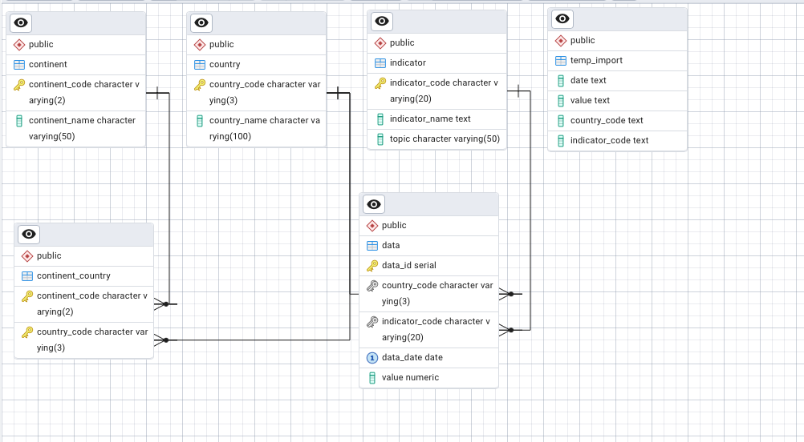

# Global Emissions & Economic Development Analysis (PostgreSQL)

A relational database and SQL analysis exploring how economic development, technology adoption, and energy mix relate to CO2 emissions across 200+ countries, built on World Bank World Development Indicators.

## The Problem

Policymakers and analysts often look at emissions data in isolation. This project asks a more useful question. How do a country's emissions relate to its income level, its macroeconomic stability, and its access to modern technology? Answering that requires joining environmental, economic, and infrastructure data into a single queryable structure, which is exactly what this database does.

## Approach

1. **Data modeling.** Designed a normalized PostgreSQL schema with a central fact table and reference tables for countries, continents, and indicators, enforcing referential integrity throughout. A unique constraint on (country, indicator, date) guarantees one value per measurement.
2. **Indicator selection.** Curated 8 World Bank indicators covering five CO2 emissions measures (total, per capita, and by solid/liquid/gaseous fuel) plus GDP per capita, inflation, and internet adoption.
3. **SQL-based ETL.** Raw CSVs load into all-text staging tables so no rows are rejected at import. A single insert then casts values to typed columns, uppercases country codes, converts blanks to NULL, and filters out roughly 45 World Bank regional and income aggregates (World, High income, Sub-Saharan Africa, and similar) that would otherwise be double counted as countries. All transformation happens in SQL, so every result is reproducible from the scripts in this repo.
4. **Analysis.** Built 14 analytical views using CTEs, window functions (`ROW_NUMBER`, `LAG`), conditional joins, and dynamic date logic (no hard-coded years) to answer questions about data completeness, emissions rankings, growth rates, and cross-indicator relationships.
5. **Validation.** A test script checks logical invariants after every rebuild, for example that no aggregate codes leaked into the fact table, that all 8 indicators loaded, and that the count of countries with any 2011 data exceeds the count with complete 2011 data.

## Key Findings

- Asia, Europe, and North America each average over 6 metric tons of CO2 per capita, roughly 5x the per-capita average of Africa.
- GDP growth is outpacing emissions growth in many countries, evidence of partial decoupling, though the pattern is uneven and many economies remain on carbon-heavy paths.
- Internet adoption tracks GDP per capita closely and serves as a strong secondary signal of development, but high connectivity does not by itself predict high emissions.
- The highest-income countries emit primarily from liquid and gas fuels, while solid-fuel reliance concentrates in lower-income economies.
- Data gaps in the World Bank dataset trace to small territories and island nations rather than major economies, so cross-country comparisons on these indicators rest on solid coverage.

## Tech Stack

- PostgreSQL (schema design, views, window functions, CTEs)
- pgAdmin for query development
- World Bank World Development Indicators (source data)

## Database Design

Five core tables organized around a central fact table, plus temporary staging tables used only during load.

| Table | Purpose |
|---|---|
| `data` | Fact table. One row per country, indicator, and date. Serial surrogate key plus a unique constraint on (country_code, indicator_code, data_date) |
| `indicator` | Reference table of indicator codes, names, and topics |
| `country` | Country codes (ISO alpha-3) and names |
| `continent` | Continent codes and names |
| `continent_country` | Junction table mapping countries to continents (many-to-many) |
| `raw_*` (x8) | All-text staging tables, one per source CSV, dropped after load |



Every analytical output is a view built on top of the five core tables, which keeps the loaded data as the single source of truth. A small helper view (`topic_indicator_codes`) centralizes the list of emissions indicators so it is defined once rather than repeated across nine views.

## Repository Structure

```
├── sql/
│   └── complete_script.sql       # Full pipeline: schema, staging, ETL load, all 14 views, tests
├── erd/
│   └── erd.png                  # Physical entity-relationship diagram
├── docs/
│   └── worldbank-emission-report.pdf # Full written report with results and commentary
└── README.md
```

## Reproducing the Analysis

**Prerequisites.** PostgreSQL 13+ with pgAdmin, and the World Bank WDI source data (see Data section below).

The entire pipeline lives in `sql/complete_script.sql`, organized into numbered sections that run in order, with one pause for the CSV import.

1. Create a PostgreSQL database and open `complete_script.sql` in pgAdmin's Query Tool.
2. Run sections 0–3. This drops any prior objects, builds the five core tables, loads the continent/country reference data, and creates the eight `raw_*` staging tables.
3. Import each World Bank CSV into its staging table using pgAdmin's Import/Export tool. The CSV-to-table mapping is listed in section 3 of the script.
4. Run section 4. This casts, cleans, and filters the staged rows into the `data` fact table, then prints row-count verification queries.
5. Run sections 5–6 to create the 14 analytical views, and section 7 to run the result queries, validation checks, and database summary.

The views use dynamic date logic, so re-running against updated WDI data produces refreshed results without editing any SQL.

## Data

Source data comes from the [World Bank World Development Indicators](https://databank.worldbank.org/source/world-development-indicators). The raw CSVs are not included in this repo. To rebuild the dataset, download the following indicator series and import each one into its matching `raw_*` staging table (the mapping is listed in section 3 of `sql/complete_script.sql`).

| Code | Indicator |
|---|---|
| EN_ATM_CO2E_KT | CO2 emissions (kt) |
| EN_ATM_CO2E_PC | CO2 emissions (metric tons per capita) |
| EN_ATM_CO2E_SF_KT | CO2 emissions from solid fuel (kt) |
| EN_ATM_CO2E_LF_KT | CO2 emissions from liquid fuel (kt) |
| EN_ATM_CO2E_GF_KT | CO2 emissions from gaseous fuel (kt) |
| NY_GDP_PCAP_CD | GDP per capita (current US$) |
| FP_CPI_TOTL_ZG | Inflation, consumer prices (annual %) |
| IT_NET_USER_P2 | Internet users (per 100 people) |

## Full Report

The complete written analysis, including result tables, scatterplots, and interpretation of all 14 views, is in [`docs/worldbank-emission-report.pdf`](docs/worldbank-emission-report.pdf). The PDF reflects the analysis as originally submitted. Two things about how it relates to the script in this repo. First, the report's queries were run against an earlier restored build of the database, while this repo's script rebuilds the entire database from scratch from the raw World Bank CSVs, so the analysis is fully reproducible without any prior database backup, and the appendix SQL in the PDF references that earlier build's table names. Second, the script includes a few corrections made after submission during code review, so some outputs differ from the report's figures. M6 now pivots all 8 selected indicators rather than the 5 emissions measures, M8 and M9 now check 2011 coverage across all 8 indicators as a logical pair (at least one vs. all), and A5 now aligns GDP and fuel emissions to the same country and year so values from different years are never compared.

## Presentation

A recorded walkthrough of the findings is available here. [Watch the presentation](PASTE_VIDEO_LINK_HERE)

## Credits

Originally developed as a team project for a graduate business database design course (California State University, Fullerton). Team members were Julian Carbajal, Chike Osakwe, Cristoval Perez, Nadia Rahbany, and Elegant Tan.

My contributions spanned every phase of the project, including the database design, SQL development, and written analysis, and I played a central role in reviewing the team's queries and interpreting the results.
